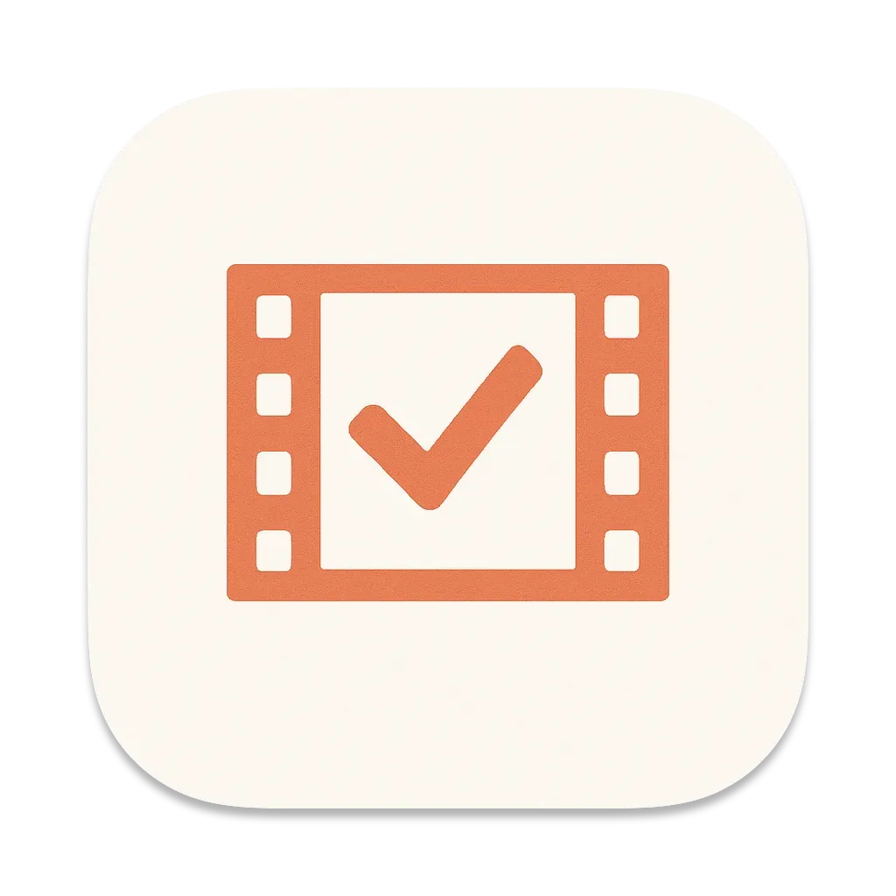
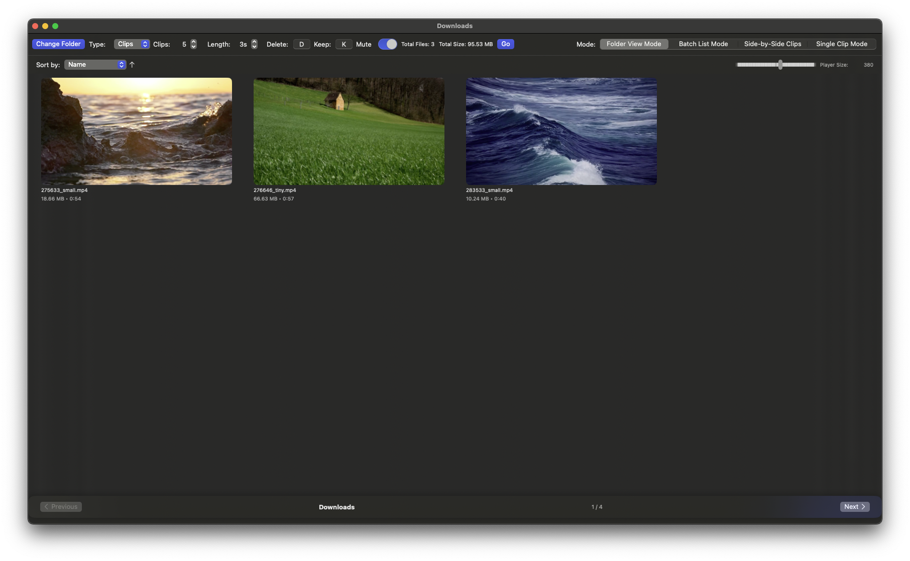
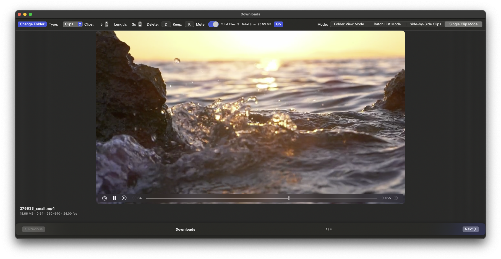

# Cullr

<p align="center">
  
</p>

<h1 align="center">Cullr</h1>

<p align="center">
  <b>Cull, preview, and manage your video files with lightning speed on macOS.</b>
</p>

---

Cullr is a modern, native macOS app for quickly previewing, sorting, and batch-managing large collections of video files. Designed for creators, editors, and anyone who needs to rapidly cull through folders of video clips, Cullr brings a fast, keyboard-driven workflow and beautiful interface to your desktop.

## ✨ Features

- **Ultra-fast video preview** with Quick Look integration
- **Batch selection and deletion** of unwanted clips
- **Multiple playback modes:**
  - Folder View
  - Single Clip
  - Side-by-Side
  - Batch List
- **Customizable hotkeys** for keep/delete actions
- **Sort by name, date, size, and more**
- **Instant thumbnail generation**
- **Support for all common video formats** (MP4, MOV, M4V, AVI, MPG, MPEG)
- **Beautiful, native macOS UI**

---

## 🖥️ Installation

### 1. Download & Build (Xcode)

1. Clone this repository:
   ```sh
   git clone https://github.com/yourusername/Cullr.git
   cd Cullr
   ```
2. Open `Cullr.xcodeproj` in Xcode.
3. Select the `Cullr` target and build (⌘B) or run (⌘R) the app.

> **Note:** Cullr requires macOS 13.0+ and Xcode 14+.

### 2. Download Prebuilt Release
- [Releases](https://github.com/yourusername/Cullr/releases)

#### How to Download and Run the Prebuilt App

1. Download the latest `.zip` file from the [Releases](https://github.com/yourusername/Cullr/releases) page.
2. Unzip it to extract `Cullr.app`.
3. If you see a message like:
   > “Cullr.app” cannot be opened because it is from an unidentified developer.
   
   Do one of the following:
   - **Right-click (or Control-click) the app** and choose **Open**. In the dialog that appears, click **Open** again. (You only need to do this the first time.)
   - **Or,** run this command in Terminal:
     ```sh
     xattr -dr com.apple.quarantine /Applications/Cullr.app
     ```
     Replace `/Applications/Cullr.app` with the actual path to the app, if it differs.

---

## 🚀 Usage

1. **Launch Cullr.**
2. **Select a folder** containing your video files.
3. **Preview videos** instantly with the spacebar or by hovering.
4. **Switch modes** (Folder, Single, Side-by-Side, Batch List) using the mode picker.
5. **Batch select** and delete unwanted clips with customizable hotkeys.
6. **Sort and filter** your collection as needed.

### Keyboard Shortcuts
- <kbd>Space</kbd>: Quick Look preview
- <kbd>K</kbd>: Keep
- <kbd>D</kbd>: Delete
- <kbd>⌘←/→</kbd>: Switch folders (if multiple selected)

---

## 📸 Screenshots

<p align="center">
  
  <br/>
  
</p>

---

## 🛠️ Development

- SwiftUI, AVKit, AppKit, Quick Look
- macOS sandboxed app (see `Cullr.entitlements`)

---

## 🙏 Credits

- App icon and UI by Friedemann Lipphardt
- Built with ❤️ for the Mac community

---

## 📄 License

Cullr is licensed under the GNU General Public License v3.0 (GPL-3.0).

- You **may not sell** this software or any derivative works.
- You **must** distribute source code and modifications under the same license (copyleft).
- See the full license text in [LICENSE](LICENSE).

---

<p align="center">
  <i>Cullr is not affiliated with Apple Inc.</i>
</p>